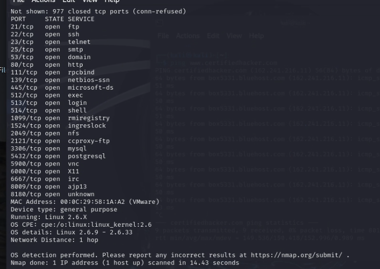

# Rapport FootPrinting
### DECAUDIN Lorenzo & MAGALHAES Dylan

## **Trouver l'adresse IP du domaine cible** :

    ping www.certifiedhacker.com

## **Émuler le traceroute** :

	ping -r www.certifiedhacker.com
	
  **1     2 ms     1 ms     2 ms  172.20.10.1
  2     *        *        *     Délai d’attente de la demande dépassé.
  3    46 ms    21 ms    20 ms  192.168.9.62
  4   105 ms    35 ms    18 ms  192.168.255.23
  5    63 ms     *       53 ms  32.177.149.194.te-dns.org [194.149.177.32]
  6    28 ms    20 ms    40 ms  194.149.173.62
  7     *       74 ms     *     99.83.88.183
  8     *        *        *     Délai d’attente de la demande dépassé.
  9    62 ms    28 ms    39 ms  prs-bb1-link.ip.twelve99.net [62.115.118.58]
 10    38 ms    56 ms    52 ms  ldn-bb1-link.ip.twelve99.net [62.115.135.24]
 11   149 ms   123 ms   121 ms  nyk-bb2-link.ip.twelve99.net [62.115.113.20]
 12   300 ms   320 ms   316 ms  palo-b24-link.ip.twelve99.net [62.115.138.111]
 13   229 ms   223 ms   324 ms  salt-b4-link.ip.twelve99.net [62.115.140.53]
 14   272 ms   312 ms   319 ms  newfolddigital-ic-380138.ip.twelve99-cust.net [80.239.167.103]
 15   203 ms   211 ms   216 ms  69-195-64-103.unifiedlayer.com [69.195.64.103]
 16   194 ms   204 ms   221 ms  po97.prv-leaf1a.net.unifiedlayer.com [162.144.240.123]
 17   201 ms   194 ms   196 ms  box5331.bluehost.com [162.241.216.11]**
 
## **Découvrir la taille de trame maximale pour le réseau** :

## Enquêtez sur le TTL (Time to Live) :

**"TTL expiré"** en réseau signifie que le TTL (Time to Live) de la trame IP a atteint 0.

Chaque routeur traversé par le paquet décrémente le TTL de 1. 

Si le TTL atteint 0, c'est que le paquet a traversé un nombre maximal de sauts autorisés avant d'atteindre sa destination.

Dans ce cas précis, le paquet est alors rejeté et affiche un message d'erreur "TTL expiré".

## Trouvez le traceroute de votre machine vers www.certifiedhacker.com et vers votre machine VULN :

Tracert de ma machine vers www.certifiedhacker.com :

Tracert de ma machine vers ma machine VULN :

**Quelles sont les différentes commandes possibles utilisées sur Windows et linux pour faire cette manipulation ?**

Sur Windows, la commande utilisée est `tracert` et sur Linux, la commande utilisée est `traceroute`.

**Combien de sauts faut-il pour que le paquet atteigne la destination spécifiée ?**

Sur Windows, il faut 17 sauts pour que le paquet atteigne la destination spécifiée.

Sur Linux, il faut 17 sauts pour que le paquet atteigne la destination spécifiée.

## Utilisation de la commande nslookup :

La commande nslookup est un outil qui permet de trouver des informations sur un nom de domaine. Par exemple, si vous tapez `nslookup www.certifiedhacker.com`, il vous donnera l'adresse IP associée à ce nom de domaine.

Quel est le serveur DNS utilisé ? 

Le serveur DNS utilisé est 172.20.10.1

## **Quel est la différence entre Non-authoritative et Authoritative ?**

**Non-authoritative** : 

Le serveur DNS ne gère pas directement le domaine dont vous demandez des informations, mais il peut avoir une idée basée sur ce qu'il a entendu d'autres serveurs DNS. 

**Authoritative** : 

Le serveur DNS qui fournit cette réponse gère directement le domaine dont vous demandez des informations, donc il sait exactement ce qui se passe avec ce domaine.

## **Quelles informations peuvent être exploitées par un attaquant et quels types d'exploits sont possibles à partir de ces informations ?**

**Adresses IP et infrastructures réseau :**

Un attaquant peux cibler des machines spécifiques en utilisant leur adresse IP. Il peut également utiliser des informations sur l'infrastructure réseau pour trouver des failles de sécurité.
On peux aussi essayer de trouver d'autres informations sur le réseau, comme les ports ouverts, les services en cours d'exécution, etc.

**Domaines et noms de domaine :**

Les domaines peuvent être utilisés pour cibler des services spécifiques (par exemple, des sites Web, des serveurs de messagerie).
Des noms de domaine mal orthographiés peuvent être utilisés pour des attaques de phishing.

**Informations sur les services et les technologies utilisées :**

Les vulnérabilités connues (CVE) peuvent être exploitées pour des attaques potentielles.
Les services avec des POC connue et fonctionelle ( en général obsolètes ou malconfiguré) peuvent être exploitée par des attaques par bruteforce, injection de code, etc.

**Informations sur les employés et la structure organisationnelle :** 

Les attaquants peuvent utiliser ces informations pour des attaques de phishing ciblées ou des attaques de compromission de comptes.
(Domaine mail, nom de l'entreprise, etc.)

**Topologie du réseau :**

Les attaquants peuvent cartographier le réseau et identifier des points faibles potentiels.

**Footprinting avec Maltego :**

IP address :

- 162.240.0.0-162.241.255.255
- 162.241.216.0-162.241.216.255
- 162.241.216.0-162.241.219.255
- 162.240.0.0
- 162.241.255.255

Domain and Domain Name Schema :

- acritch.com
- blackfeministsociology.com
- cardozoaelj.com
- tabletopbuilds.com
- perfectliberty.org
- westhoustoncounseling.com
- tinyrightbrain.com
- tamurasmarket.com
- amiaconference.net
- festivalofarchives.org
- bayesium.com
- certifiedhacker.com

Server Side Technology 

- cpe:/a:apache:http_server
- cpe:/a:openbsd:openssh:7.4
- cpe:/a:exim:exim:4.96.2
- cpe:/a:pureftpd:pure-ftpd

Name Server 

Mail Exchanger 

Geographical Location 

Entities 

Email addresses and Phone numbers

## Impact du TCP SYN/UDP-TCP Flooding dans une Attaque DDoS et Moyens d'Atténuation

Les attaques DDoS utilisant le TCP SYN flooding et l'UDP/TCP flooding peuvent saturer la bande passante réseau et les ressources serveur, entraînant une interruption de service pour les utilisateurs légitimes. 

**Pour contrer ces attaques :**

**Filtrage au Niveau du Pare-feu :** Bloquer le trafic suspect via les pare-feu pour empêcher les paquets SYN ou UDP/TCP malveillants d'atteindre les serveurs.

**Limitation des Connexions :** Configurer les serveurs pour limiter le nombre de connexions SYN ou de requêtes UDP/TCP par IP afin de réduire l'impact des attaques.

**Utilisation de Services de Mitigation DDoS :** Collaborer avec des fournisseurs spécialisés pour détecter et atténuer les attaques DDoS en temps réel, en redirigeant le trafic malveillant loin des serveurs cibles.

En combinant ces mesures, les entreprises peuvent mieux se défendre contre les attaques DDoS et maintenir la disponibilité de leurs services en ligne.

Identifiez le système d'exploitation de la machine cible avec TTL :

Le TTL de 48 indique que la machine cible utilise un système que nous ne pouvons identifier, cela peux-être aussi bien un système Linux, un switch, un routeur, etc.

Windows a un TTL de 128, Linux a un TTL de 64, et Cisco a un TTL de 255.

## Scan avec Nmap : 

### Scan réseau entier :

``-sn : spécifie scan TCP Null``
``-sX : spécifie scan TCP Xmas``
``-sA : spécifie scan TCP ACK``
``-sU : spécifie scan UDP``
``-p : spécifie le port``
``--packet-trace : affiche les paquets envoyés et reçus``
``-sN : spécifie scan TCP Null``
``-T4 : spécifie le timing``
``-sS : spécifie scan TCP SYN``

------------------------------------------------------

**nmap -sn 192.168.195.0/24**

------------------------------------------------------

**nmap -sX 192.168.195.0/24**

------------------------------------------------------

**nmap -sA 192.168.195.134**

------------------------------------------------------

**nmap -sU 192.168.195.134**

------------------------------------------------------

**nmap -p 1-65535 --packet-trace 192.168.195.134**

 **nmap -sN -T4 192.168.195.134**

 

**nmap -sT -O 192.168.195.134**

Les diverses scans montre qu'il y a plusieurs services actifs sur cet hôte. On peut voir des trucs standard comme **FTP**, **SSH** et **HTTP**, ainsi que d'autres plus spécifiques comme **MySQL**, **PostgreSQL** et **VNC**. 
**
La présence de **Telnet** et **NetBIOS** pourrait indiquer un niveau de sécurité moins élevé. 

En gros, l'hôte offre plusieurs possibilités d'accès, mais il faudrait bien sécuriser ces services ou les masquer pour éviter les problèmes de sécurité. 

------------------------------------------------

## Éviter la détection lors d'un scan réseau :

 Cela peut être difficile mais pas impossible. Voici quelques techniques qui peuvent être utilisées pour rendre plus difficile la détection :

**Firewall et filtrage de paquets:** 

Configurer un pare-feu pour filtrer les paquets et bloquer les scans non autorisés peut rendre plus difficile la détection des services.

**Port knocking:** 

Cette méthode implique de fermer tous les ports de manière standard et de ne les ouvrir qu'après avoir reçu une séquence spécifique de requêtes de connexion sur d'autres ports.

**Masquage des signatures de service:** 

Modifier les signatures de service par défaut peut rendre plus difficile l'identification des services actifs. Par exemple, changer le bannière du serveur web Apache pour qu'elle ne révèle pas la version spécifique.

**Utilisation de tunnels chiffrés:**

Utiliser des tunnels chiffrés tels que VPN ou SSH pour accéder aux services internes peut rendre plus difficile la détection des services depuis l'extérieur.

**Scans furtifs:**

Utiliser des outils de scan furtifs qui envoient des paquets de manière moins intrusive peut réduire les chances d'être détecté. Cependant, cela peut également prolonger la durée du scan.

**Modification des paramètres par défaut:**

Changer les numéros de port par défaut des services peut rendre plus difficile la détection. Par exemple, utiliser le port 8080 au lieu du port 80 pour HTTP.

Il est important de noter que certaines de ces techniques peuvent être complexes à mettre en œuvre et peuvent entraîner des complications dans la gestion et la maintenance du réseau. De plus, toute tentative de dissimulation des services peut être considérée comme suspecte et contraire aux politiques de sécurité dans certains contextes. Il est donc essentiel de peser les avantages et les inconvénients avant de mettre en œuvre de telles mesures.

## Comment NMAP peux contourner ces techniques de dissimulation ?

Nmap propose plusieurs options qui peuvent aider à contrer les techniques de dissimulation et à détecter les services même lorsqu'ils tentent de se cacher. Voici quelques-unes des options que vous pouvez utiliser :

**Scan de tous les ports (-p-):**

 Utilisez l'option "-p-" pour scanner tous les ports, même ceux qui sont généralement considérés comme non standard. Cela augmente les chances de détecter des services cachés qui pourraient utiliser des ports non conventionnels.

**Détection de version (--version-all):**

Utilisez l'option "--version-all" pour activer la détection de version sur tous les ports. Cela peut aider à identifier les services qui tentent de masquer leur identité en modifiant leurs bannières.

**Détection de l'OS (-O):**

Utilisez l'option "-O" pour tenter de détecter le système d'exploitation de l'hôte cible. Parfois, les différences dans la manière dont les systèmes d'exploitation répondent aux requêtes peuvent aider à identifier les hôtes qui tentent de se cacher.

**Scans agressifs (--scanflags, -sA):** 

Les scans agressifs comme le scan de type ACK (-sA) ou le scan de type SYN avec des drapeaux TCP personnalisés (--scanflags) peuvent contourner certaines techniques de dissimulation en envoyant des paquets de manière plus furtive.

**Détection de script (--script):**

Nmap propose une vaste bibliothèque de scripts NSE (Nmap Scripting Engine) qui peuvent être utilisés pour détecter des vulnérabilités spécifiques ou des signes de services cachés.

**Scans en profondeur (-T4, -T5):** 

Utilisez des niveaux de vitesse de scan plus élevés comme -T4 ou -T5 pour augmenter la probabilité de détecter des services cachés en réduisant le temps entre les requêtes.

## Exploitation de vulnérabilités :

-	Quelle est le software/version spécifique du service FTP ?
``vsftpd 2.3.4``
-	Quelles sont les vulnérabilités qui touchent cette version ?

``Authentication Bypass :``
Il existe une vulnérabilité de type backdoor dans la version 2.3.4 de vsftpd qui permet à un attaquant distant de se connecter au serveur FTP sans authentification.

-	Comment exploiter cette vulnérabilité ?

Pour exploiter cette vulnérabilité, un attaquant peut se connecter au serveur FTP en utilisant un nom d'utilisateur spécifique ``(":)")`` pour contourner l'authentification et obtenir un accès non autorisé au système.

On peux utiliser Metasploit pour exploiter cette vulnérabilité. 

``msfconsole``

``use exploit/unix/ftp/vsftpd_234_backdoor``

``set RHOST 192.168.195.134``

``exploit``

**``On peux voir que l'utilisateur est "USER 331"``**

## Pour scanner la version des deux services : 

**nmap -sV -p 139,445 192.168.195.134**

-	Quelle est le software/version spécifique du service SMB ?
``Samba smbd 3.X - 4.X``

-	Quelles sont les vulnérabilités qui touchent cette version ?

``CVE-2017-7494 :``
Il existe une vulnérabilité connue sous le nom de "SambaCry" (CVE-2017-7494) qui permet à un attaquant distant de prendre le contrôle du serveur Samba en envoyant des paquets spécialement conçus.

-	Comment exploiter cette vulnérabilité ?

Pour exploiter cette vulnérabilité, un attaquant peut envoyer des paquets malveillants au serveur Samba pour exécuter du code arbitraire et prendre le contrôle du système.

On peux utiliser Metasploit pour exploiter cette vulnérabilité. 

``msfconsole``

``use exploit/multi/samba/usermap_script``

``set RHOST IP``

``exploit``

-	Quelle est le software/version spécifique du service NetBIOS ?
``139/tcp open netbios-ssn (workgroup: WORKGROUP)``

-	Quelles sont les vulnérabilités qui touchent cette version ?
``La même vulnérabilité que SMB.``
          
## Sécurité Windows :

-	Quel est l’ID (CVE) de la vulnérabilité EternalBlue ? 
``CVE-2017-0144``
-	Quelle est la sévérité de cette vuln ? (criticité + CVSS) 
``La sévérité de cette vulnérabilité est critique avec un score CVSS de 9.3.``
``AV:N/AC:M/Au:N/C:C/I:C/A:C``

-	Quel est le service Windows qui est affecté par cette vulnérabilité ? 
``Le service Windows affecté par cette vulnérabilité est le service SMB (Server Message Block).``

-	Comment exploiter cette vulnérabilité ? 
``Pour exploiter cette vulnérabilité, un attaquant peut envoyer des paquets malveillants au service SMB pour exécuter du code arbitraire et prendre le contrôle du système.``

## Exploitation de la vulnérabilité EternalBlue :
Pré-requis :
-	Windows 7 SP1 x64
- Pas de pare-feu ou désactivé
- Pas de mise à jour de sécurité

**``On peux utiliser Metasploit pour tester cette vulnérabilité, cependant on peux aussi utiliser WannaCry ou NotPetya, qui sont des ransomwares qui exploitent cette vulnérabilité, mais c'est illégal.``**

``msfconsole``

``use exploit/windows/smb/ms17_010_eternalblue``

``set RHOST IP``

``exploit``

•	Comment pouvez-vous déterminer le nom de la machine cible sur laquelle vous avez réussi à exploiter EternalBlue ?
``En utilisant la commande "sysinfo" dans l'invite de commande, on peut déterminer le nom de la machine cible.``

•	Quelles sont les commandes ou techniques que vous pouvez utiliser pour identifier les utilisateurs actuellement connectés à la machine cible ?
``On peux utiliser la commande "net session" pour identifier les utilisateurs actuellement connectés à la machine cible sinon, pour voir tout les utilisateurs même ceux qui ne sont pas connecté, on peux utiliser la commande "net user".``

•	Comment pouvez-vous vérifier les privilèges ou les niveaux d'accès de l'utilisateur actuellement connecté sur la machine cible ?
``On peux utiliser la commande "whoami" pour vérifier les privilèges ou les niveaux d'accès de l'utilisateur actuellement connecté sur la machine cible, ou sinon, on peux utiliser la commande "net user nom_utilisateur" pour voir les informations sur un utilisateur spécifique.``

•	Quels fichiers ou répertoires pouvez-vous explorer pour obtenir des informations sensibles sur la machine cible ?
``On peux explorer les fichiers et répertoires suivants pour obtenir des informations sensibles sur la machine cible :``

``C:\Users<NomUtilisateur>``
``C:\Users\Publicv``
``C:\Windows\System32\config``
``C:\ProgramData``
``C:\Windows\System32\drivers\etc``
``C:\Windows\Temp``
``C:\Windows\Prefetch``
``C:\Windows\Fonts``
``C:\Program Files``
``C:\Program Files (x86)``

